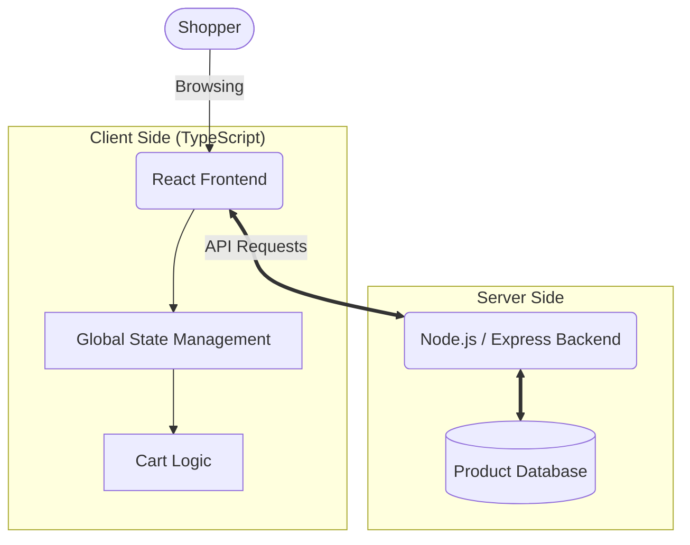

<div align="center">
  
</div>

<p align="center">
  
  
  
  
</p>

> A sleek, high-performance e-commerce web application built entirely with **TypeScript**. Designed to deliver a premium shopping experience with modern UI/UX principles, seamless cart management, and secure checkout flows.

---

## 🎥 Video Demonstration

*(Drag and drop your `.mp4` or `.mov` video file right here in the GitHub editor! GitHub will automatically upload it and turn it into a playable video player).*

---

## ✨ Features

- 💎 **Premium UI/UX:** A fully responsive, mobile-first design built with modern CSS frameworks (like Tailwind) for fluid animations and a polished aesthetic.
- 🛒 **Dynamic Cart Management:** Real-time state management for adding, removing, and updating cart items without page reloads.
- 🔍 **Product Filtering & Search:** High-performance catalog browsing with category filtering and keyword search.
- 🔒 **Type-Safe Architecture:** Built front-to-back with **TypeScript** to eliminate runtime errors, enforce strict data models, and ensure a highly maintainable codebase.

---

## 🏗️ Technical Architecture



---

## 🚀 Quick Start

### 📋 Prerequisites
- **Node.js** (v18+)
- **npm** or **yarn**

### 1️⃣ Installation
Clone the repository and install dependencies:
```bash
git clone https://github.com/MohamadAtamneh404/LuxeFashion.git
cd LuxeFashion
npm install
```

### 2️⃣ Run Development Server
Start the local development server:
```bash
npm run dev
```
The application will be running at `http://localhost:3000` (or your configured port).

---

## 🎓 About

Developed by **Mohamad Atamleh** <br/>
[GitHub](https://github.com/MohamadAtamneh404) | [LinkedIn](https://linkedin.com/in/mohamad-atamleh-a43185381)
